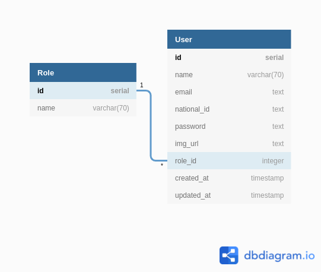
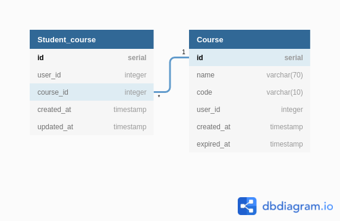
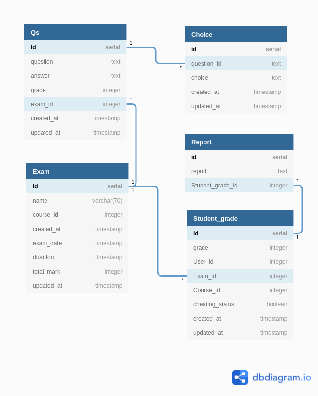
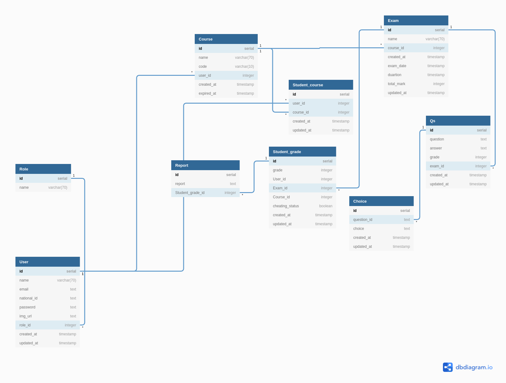

   
  <h1>D-Exam with Anti Cheat System</h1>

## Table of contents

- [**Summary**](#summary)
- [**Features**](#features)
- [**System architecture**](#system-architecture)
- [**Use case diagram**](#use-case-diagram)
- [**ERD**](#erd)
  - [**User service**](#user-service)
  - [**Course service**](#Course-service)
  - [**Exam service**](#Exam-service)

## Summary

With the current world pandemic everyone is moving towards online exams as it’s much safer for the students, with that said, our project aims to have a reliable exams system that prevent students from cheating. Our system will give teachers the ability to create their own exams and provide them to their students. The system will have an efficient anti-cheat system with uncommon cheating detection techniques that aims to achieve equality and fairness. It will not be limited to Multiple-Choice Questions only and will have different types of questions so that the grading system will not be restricted only to the final answer with an auto correction for some types of questions.

##  Features

- **Face Authentication**: User will have to verify his identity before entering the exam by scanning his face through the laptop’s camera and comparing it with his existing profile picture on the system, it will continue with him through the session by either taking multiple screenshots at different time or only when the system detects a change that needs a confirmation. 
- **Eye Tracking**: User will have to look at some objects on the screen to determine the dimensions of the screen then the system will detect any suspicious behavior from the user (looking at his phone/book/another screen). The system will not always take an immediate action but will be there different scenarios for this.
- **Keystrokes**: User keyboard’s input will be recorded/detected to prevent the eye tracking from being triggered. 
- **Restricting Device Usage**: User will not be able to normally use the device till he finishes the exam. OS services and applications will be suspended. 
- **IP Detection**: Checking if there are multiple students using the same internet, action will be taken manually from the supervisor/authorized person.

##  System architecture

##  

##  Use cases diagram

##  ERD

### User service

### Course service

### Exam service

We created three databases communicate with each others using a message broker because of we use microservices architecture as shown in the [System architecture](#System-architecture). but to make the reader relates about the relations between the three databases using foreign keys, we put the ERD of the database if we used a shared database.

